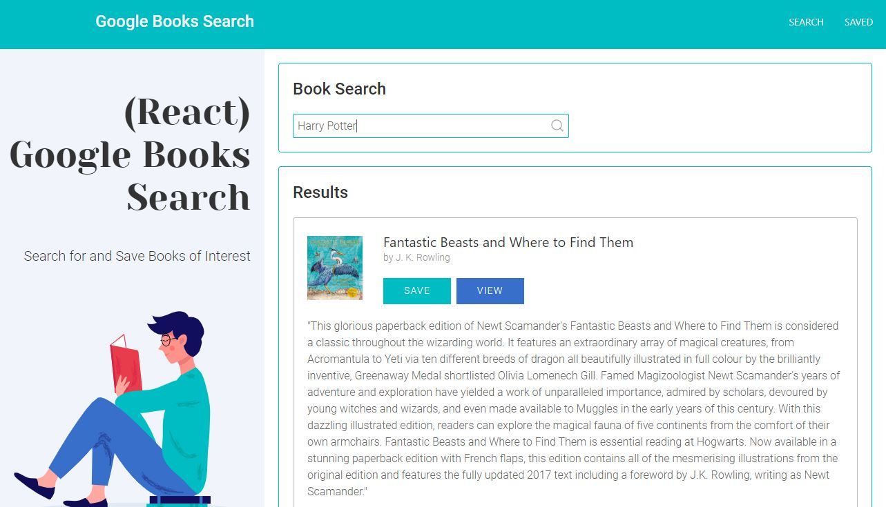
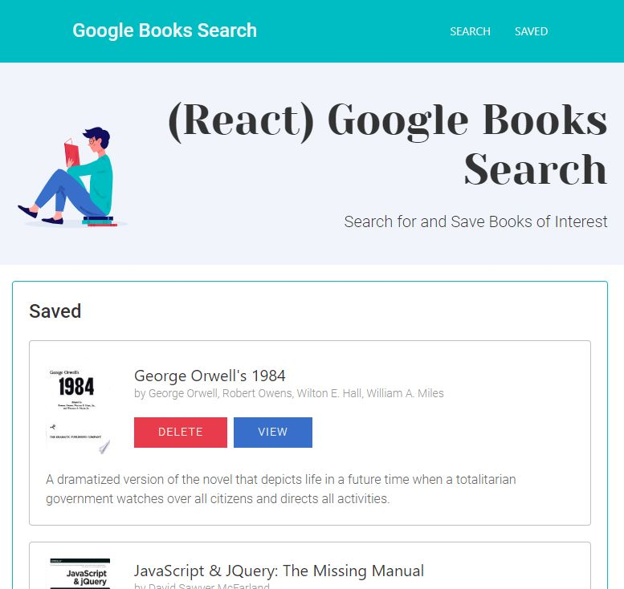
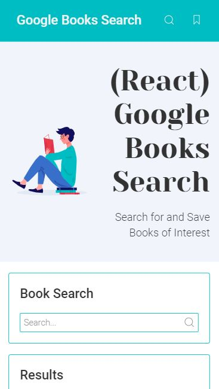

# 21 Google Books Search
> A React-based Google Books Search app

This was a homework assignment where we I created a new React-based Google Books Search app. This assignment required me to create React components, work with helper/util functions, and utilize React lifecycle methods to query and display books based on user searches. I also used Node, Express and MongoDB so that users can save books to review or purchase later.

## Completed

* 2 pages:

  * Search - User can search for books via the Google Books API and render them here. User has the option to "View" a book, bringing them to the book on Google Books, or "Save" a book, saving it to the Mongo database.

  * Saved - Renders all books saved to the Mongo database. User has an option to "View" the book, bringing them to the book on Google Books, or "Delete" a book, removing it from the Mongo database.

* Used a class activity example as a base for this app

* Added code to connect to a MongoDB database named `googlebooks` using the mongoose npm package.

* Used mongoose to create a Book schema.

* At a minimum, books should have each of the following fields:

  * `title` - Title of the book from the Google Books API

  * `authors` - The books's author(s) as returned from the Google Books API

  * `description` - The book's description as returned from the Google Books API

  * `image` - The Book's thumbnail image as returned from the Google Books API

  * `link` - The Book's information link as returned from the Google Books API

* The layout includes at least two React Components for each page `Search` and `Saved`.

* Used UIKit css framework.

* Added the following Express routes for the app:

  * `/api/books` (get) - Should return all saved books as JSON.

  * `/api/books` (post) - Will be used to save a new book to the database.

  * `/api/books/:id` (delete) - Will be used to delete a book from the database by Mongo `_id`.

* Deployed to Heroku

## User Story
AS A book enthusiast  
I WANT to be able to search for books  
SO that I can buy or save them for later

## Deployed Link
[Google Books Search](https://twenty-one-google-books-search.herokuapp.com/)

## Screenshots
  
  
  
